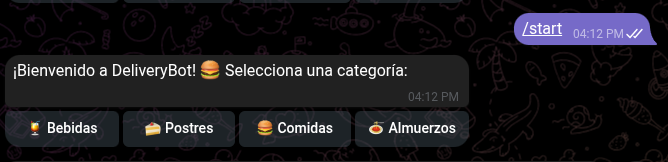
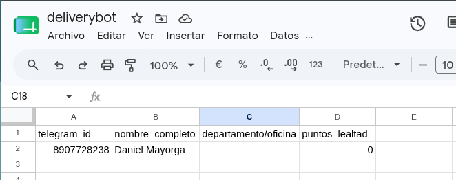
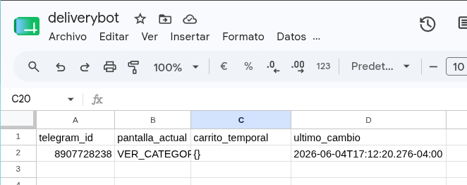

# 06 — Pruebas y Evidencias

## Módulo 01 — Menú y Navegación

### Casos de prueba

| # | Acción | Resultado esperado | Estado |
|---|--------|-------------------|--------|
| 1.1 | Usuario nuevo envía `/start` | Bot registra usuario en USUARIOS, crea sesión en SESSION, muestra 4 categorías (Bebidas - Postres - Almuerzos - Comidas) | ⬜ Pendiente |
| 1.2 | Usuario existente envía `/start` | Bot resetea la sesión (carrito vacío) y muestra 4 categorías | ⬜ Pendiente |
| 1.3 | Usuario envía texto aleatorio sin sesión | Bot responde: *"Para iniciar tu pedido, envía /start 🚀"* | ⬜ Pendiente |

### Evidencias

Mensaje reflejado en el Bot de Telegram

Se guarda dentro del google Sheets, Junto a la sesion guardada

## Módulo 02 — Carrito y Pedidos

### Casos de prueba

| # | Acción | Resultado esperado | Estado |
|---|--------|-------------------|--------|
| 2.1 | Usuario selecciona categoría "Bebidas" | Bot muestra lista numerada de bebidas del menú | ⬜ Pendiente |
| 2.2 | Usuario ingresa número de producto válido | Bot confirma el producto y solicita cantidad | ⬜ Pendiente |
| 2.3 | Usuario ingresa número fuera de rango | Bot muestra error de selección inválida | ⬜ Pendiente |
| 2.4 | Usuario ingresa cantidad válida (ej: 2) | Bot muestra resumen del carrito con totales y 3 botones | ⬜ Pendiente |
| 2.5 | Usuario ingresa cantidad inválida (ej: "abc") | Bot muestra error de cantidad inválida | ⬜ Pendiente |
| 2.6 | Usuario agrega productos de 2 categorías distintas | El carrito acumula ambos productos correctamente | ⬜ Pendiente |

### Evidencias
> Agregar capturas en `docs/assets/capturas_modulo_02/`

---

## Módulo 03 — Gestor de Estados

### Casos de prueba

| # | Acción | Resultado esperado | Estado |
|---|--------|-------------------|--------|
| 3.1 | Usuario presiona "✅ Confirmar" con stock disponible | Se registra el pedido en PEDIDOS, se descuenta stock de MENU, bot confirma al usuario | ⬜ Pendiente |
| 3.2 | Usuario presiona "✅ Confirmar" con stock insuficiente | Bot informa que no hay stock suficiente | ⬜ Pendiente |
| 3.3 | Usuario presiona "➕ Seguir comprando" | Bot muestra las 4 categorías nuevamente, preserva el carrito | ⬜ Pendiente |
| 3.4 | Usuario presiona "❌ Cancelar pedido" | Bot limpia el carrito, muestra aviso de cancelación | ⬜ Pendiente |
| 3.5 | Verificar hoja PEDIDOS tras confirmación | Se registra una fila con todos los campos correctos | ⬜ Pendiente |
| 3.6 | Verificar hoja SESSION tras confirmación | `pantalla_actual=VER_CATEGORIAS`, `carrito_temporal={}` | ⬜ Pendiente |

### Evidencias

---

## Módulo 04 — Reportes y Ventas

### Casos de prueba

| # | Acción | Resultado esperado | Estado |
|---|--------|-------------------|--------|
| 4.1 | Ejecución manual del Schedule Trigger | Admin recibe mensaje con reporte del día | ⬜ Pendiente |
| 4.2 | Reporte con 0 pedidos del día | Admin recibe mensaje indicando sin actividad | ⬜ Pendiente |
| 4.3 | Reporte con múltiples pedidos | Total vendido, producto estrella y hora pico calculados correctamente | ⬜ Pendiente |

### Evidencias
> Agregar capturas en `docs/assets/capturas_modulo_04/`

---

## Resumen General

| Módulo | Total pruebas | Aprobadas | Fallidas | Pendientes |
|--------|--------------|-----------|---------|-----------|
| 01 — Menú y Navegación | 3 | 0 | 0 | 3 |
| 02 — Carrito y Pedidos | 6 | 0 | 0 | 6 |
| 03 — Gestor de Estados | 6 | 0 | 0 | 6 |
| 04 — Reportes y Ventas | 3 | 0 | 0 | 3 |
| **Total** | **18** | **0** | **0** | **18** |
