# 06 — Pruebas y Evidencias

## Módulo 01 — Menú y Navegación

### Casos de prueba

| # | Acción | Resultado esperado | Estado |
|---|--------|-------------------|--------|
| 1.1 | Usuario nuevo envía `/start` | Bot registra usuario en USUARIOS, crea sesión en SESSION, muestra 4 categorías (Bebidas - Postres - Comidas - Almuerzos) | ✅ Aprobado |
| 1.2 | Usuario existente envía `/start` | Bot resetea la sesión (`pantalla_actual=VER_CATEGORIAS`, `carrito_temporal={}`) y muestra 4 categorías | ✅ Aprobado |
| 1.3 | Usuario envía texto aleatorio sin sesión | Bot responde: *"Para iniciar tu pedido, envía /start 🚀"* | ⬜ Pendiente |

### Evidencias

Mensaje reflejado en el Bot de Telegram

Se guarda dentro del google Sheets, Junto a la sesion guardada

## Módulo 02 — Carrito y Pedidos

### Casos de prueba

| # | Acción | Resultado esperado | Estado |
|---|--------|-------------------|--------|
| 2.1 | Usuario selecciona categoría "Bebidas" | Bot muestra lista numerada de bebidas del menú (ej: 1. Coca Cola $6500, 2. Jugo Natural $4000) | ✅ Aprobado |
| 2.2 | Usuario ingresa número de producto válido (ej: 1) | Bot confirma "✅ Seleccionaste: Coca Cola — Precio: $6500" y solicita cantidad | ✅ Aprobado |
| 2.3 | Usuario ingresa número fuera de rango | Bot muestra error de selección inválida | ⬜ Pendiente |
| 2.4 | Usuario ingresa cantidad válida (ej: 3) | Bot muestra resumen del carrito "Coca Cola x3 = $19500 — Total: $19500" con 3 botones (Confirmar / Seguir comprando / Cancelar) | ✅ Aprobado |
| 2.5 | Usuario ingresa cantidad inválida (ej: "abc") | Bot muestra error de cantidad inválida | ✅ Aprobado |
| 2.6 | Usuario agrega productos de 2 categorías distintas | El carrito acumula ambos productos correctamente | ✅ Aprobado |

### Evidencias
Flujo de trabajo en n8n al seleccionar una categoría:

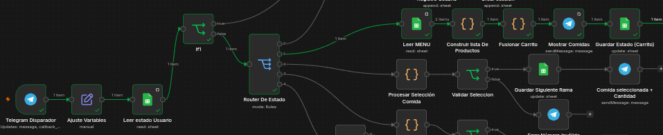

Al escoger la categoría Bebidas, el bot lista los productos disponibles:

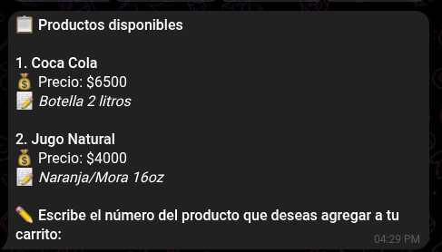

Al ingresar el número 1, el bot confirma "Coca Cola" y solicita la cantidad:

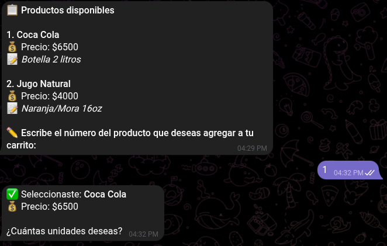

Flujo de trabajo en n8n al procesar la selección del producto:

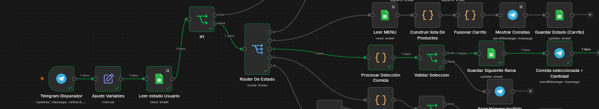

Al ingresar la cantidad (3), el bot muestra el resumen del carrito con los 3 botones de acción:

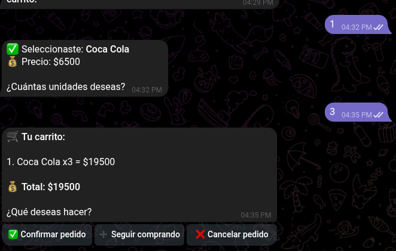

## Módulo 03 — Gestor de Estados

### Casos de prueba

| # | Acción | Resultado esperado | Estado |
|---|--------|-------------------|--------|
| 3.1 | Usuario presiona "✅ Confirmar" con stock disponible | Bot confirma al usuario ("¡Pedido confirmado! N° PED-xxx") y envía notificación al cocinero ("🔔 Nuevo pedido"); pedido se registra en PEDIDOS | ✅ Aprobado |
| 3.2 | Usuario presiona "✅ Confirmar" con stock insuficiente | Bot responde "⚠️ Stock insuficiente: ❌ [producto]: solo quedan 0 unidades (pediste 2). Modifica tu carrito o escribe /start para reiniciar." | ✅ Aprobado |
| 3.3 | Usuario presiona "➕ Seguir comprando" | Bot muestra el resumen del carrito actual y luego las 4 categorías nuevamente (Bebidas - Postres - Comidas - Almuerzos) | ✅ Aprobado |
| 3.4 | Usuario presiona "❌ Cancelar pedido" | Bot limpia el carrito, muestra aviso de cancelación | ⬜ Pendiente |
| 3.5 | Verificar hoja PEDIDOS tras confirmación | Se registra fila con: `id_pedido`, `id_usuario`, `detalle_pedido` (ej: Coca Cola x3), `total_pagar` (ej: 19500), `estado=Recibido`, `fecha`, `hora` | ✅ Aprobado |
| 3.6 | Verificar hoja SESSION al presionar "✅ Confirmar" | `pantalla_actual=CONFIRMAR_PEDIDO`, `carrito_temporal` contiene los ítems del pedido activo | ✅ Aprobado |
| 3.7 | Cocinero envía `/estado PED-xxx-xxx Preparación` | Bot actualiza estado en PEDIDOS, cliente recibe notificación con emoji 👨‍🍳, cocinero recibe confirmación | ⬜ Pendiente |
| 3.8 | Cocinero envía `/estado` con ID inexistente | Bot responde "❌ Pedido X no encontrado" al cocinero | ✅ Aprobado |
| 3.9 | Cocinero envía `/ayuda` | Bot muestra la guía completa de comandos al cocinero | ✅ Aprobado |

### Evidencias
Al darle click al boton CONFIRMAR:

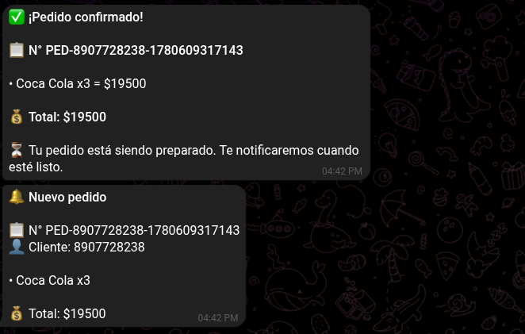

Registra el pedido dentro del Google Sheets dentro de la hoja Usuario.

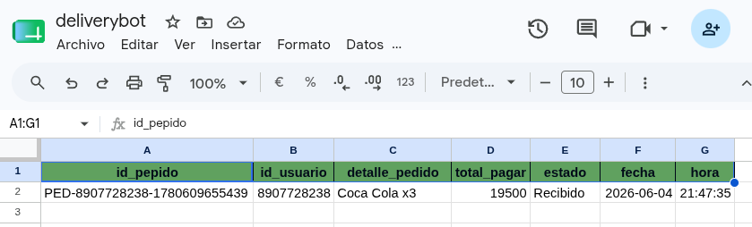

Junto la pantalla actual en la que se encuentra en la hoja session:

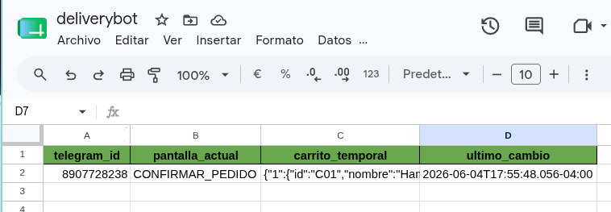

Si quieres segir comprando, te dara el catalogo para que lo agregues a tu carrito:

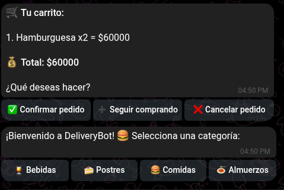

Si no hay suficientes Coca Colas dentro del Stock.

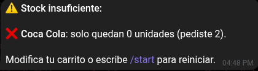

Al cancelar carrito, este solo te dira que el pedido ha sido canselado.

Flujo de trabajo cocinero :

---

## Módulo 04 — Reportes y Ventas

### Casos de prueba

| # | Acción | Resultado esperado | Estado |
|---|--------|-------------------|--------|
| 4.1 | Ejecución del Schedule Trigger | Admin recibe mensaje de reporte con fecha, total vendido, pedidos procesados, producto estrella y hora pico | ✅ Aprobado |
| 4.2 | Reporte con 0 pedidos del día | Admin recibe mensaje indicando sin actividad | ⬜ Pendiente |
| 4.3 | Reporte con múltiples pedidos | Total vendido: $99500, Pedidos procesados: 2, Producto estrella: Coca Cola (3 unidades), Hora pico: 21:00 (2 pedidos) | ✅ Aprobado |

### Evidencias
Workflow De reporte diario en n8n

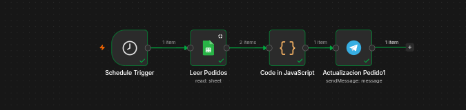

Mensaje del reoprte del dia

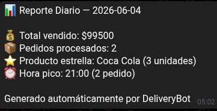

---